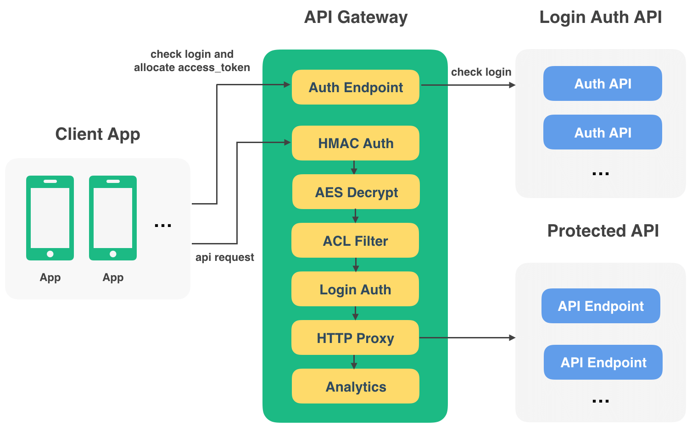

# Fomalhaut

[](https://travis-ci.org/restran/fomalhaut)
[](https://coveralls.io/github/restran/fomalhaut?branch=master)

fomalhaut is an api gateway acts as the frontend and api router for numerous backend json api servers.

This project is still in development, api may change anytime. If you want to use it, fix what you need.

API is connected to the App and the server database of the bridges, in the App and various API after for these API management and protection brings a series of problems.For example:

1. How to protect the API from unauthorized access, only by the App initiates normal request?
2. How to control a different App for many API access permissions?
3. API access how to log how to view it?

Thus, it is with fomalhaut this project.

## Similar items

- [kong](https://getkong.org/)
- [zuul](https://github.com/Netflix/zuul)
- [strong-gateway](https://github.com/strongloop/strong-gateway)

## The environment and dependencies

Supported Python versions: 2.7, 3.3, 3.4, 3.5, 3.6 pypy, pypy3

You need to install Redis first, the corresponding dependency package can be installed by the following command:

    pip install -r requirements.txt
```
## Valid time of access signature, seconds
SIGNATURE_EXPIRE_SECONDS = 3600

HOST = '127.0.0.1'
PORT = 6500

# Is the debug mode
DEBUG = False

# Redis configuration
REDIS_HOST = '127.0.0.1'
REDIS_PORT = 6379
REDIS_DB = 0
REDIS_PASSWORD = 'your_password'
```

Run

    python -m fomalhaut.runserver --port=6500

## Related projects

1. [api-gateway-dashboard](https://github.com/restran/api-gateway-dashboard) Web Console for API Gateway
2. [api-python-client](https://github.com/restran/api-python-client) Python version of API Client


## Design description

This is a gateway to the JSON API, which actually works regardless of what is being transferred behind the protected API, except that the gateway will return an error message to the JSON data if something goes wrong. In the design of the [torngas](https://github.com/mqingyn/torngas) middleware mode. Currently only the `GET` and `POST` methods are supported.



### HMAC signature

As with most cloud applications, each Client will be assigned a pair of `access_key` and `secret_key`.`access_key` is used to uniquely identify the Client,`secret_key` is used to perform HMAC signature and AES encryption.Both the URL of the API request and the Body data are signed by `secret_key`, and the signature of the data is verified bidirectionally to ensure that the request and the returned data are not tampered with.The signature method uses the HMAC-SHA256.

### Special status codes

In order to distinguish the gateway level when there is an error in the implementation of the return data, or behind the real API to provide services to return data, define a special `status code 949`, if the status code is 949, then the gateway returns.

### AES encryption

Although HTTPS is popular in most sites, but if you still can only use HTTP, or there is a middleman attack, there is a risk of data content leakage,thus providing AES encryption function, you can transfer data URL, Headers, Body are encrypted, AES encryption is optional.

### Login verification

There are cases where some APIs need to be logged in before they can be accessed, and others do not.fomalhaut has built-in Auth Endpoint (endpoint_name: auth, version: v1) and includes three APIs:

1. `/auth/v1/login/` Login
2. `/auth/v1/token/refresh/` get new `access_token` with `refresh_token'
3. `/auth/v1/token/alive/` check `access_token` is valid
4. `/account/v1/logout/` logout
5. `/account/v1/password/change/` Change Password

For APIs that require login, you need to first access `/auth/v1/login/` to get `access_token`, the data returned is as follows:


```json
{
    "code": 200,
    "msg": "",
    "data": {
        "access_token": "abcd",
        "refersh_token": "efgh",
        "expires_in": 168000,
        "user_info": {
        
        }
    }
}
```

- `expires_in`: `access_token` will expire after many seconds
- `refresh_token`: when `access_token` expires, it is used to get the new `access_token`
- `user_info`: user information returned by the Auth API

`/auth/v1/login/` API will check whether the submitted login information is correct according to the configured Auth API, if the login is correct Auth API returns the user information.

`/auth/v1/token/refresh/`API used to fetch new `access_token`, submitted data：

```json
{
    "refersh_token": "efgh"
}
```

Later access requires login to access the API in the url with access_token, for example:

    http://api.example.com/api-name/v1/?access_token=abcd

API Gateway will use this `access_token` to verify the validity of the `access_token` in redis when accessing the APIs that need to be logged in, and obtain the user's information.The user information is then stored in Headers and passed to the backend API with `X-User-Json`.The data stored in this Header is base64 encoded data of the JSON string of user_info.

## Deploy and use

The built-in Endpoint needs to be configured in the console api-gateway-dashboard

### Access log storage

To speed things up, the access logs generated by fomalhaut are temporarily stored in the list in Redis, and a Celery scheduled task is configured in the api-gateway-dashboard project that automatically migrates the access logs to MongoDB.Therefore, these Celery tasks must be run at the same time, in order to ensure the normal operation of fomalhaut.

For more information about how to run these Celery background tasks, see [api-gateway-dashboard] (https://github.com/restran/api-gateway-dashboard) of the relevant documents.

## TODO

- [x] login check, check `access_token`
- [x] built-in login, logout and update `access_token` API
- [ ] Single sign-on, login in one place, old `access_token` and `refresh_token` to be invalidated
- [x] access to the log store for requesting full content for size limits
- [x] configuration information in-program cache
- [ ] API monitoring, access exception can mail alarm
- [ ] Rate-Limiting
- [ ] api-android-client
- [ ] api-swift-client
