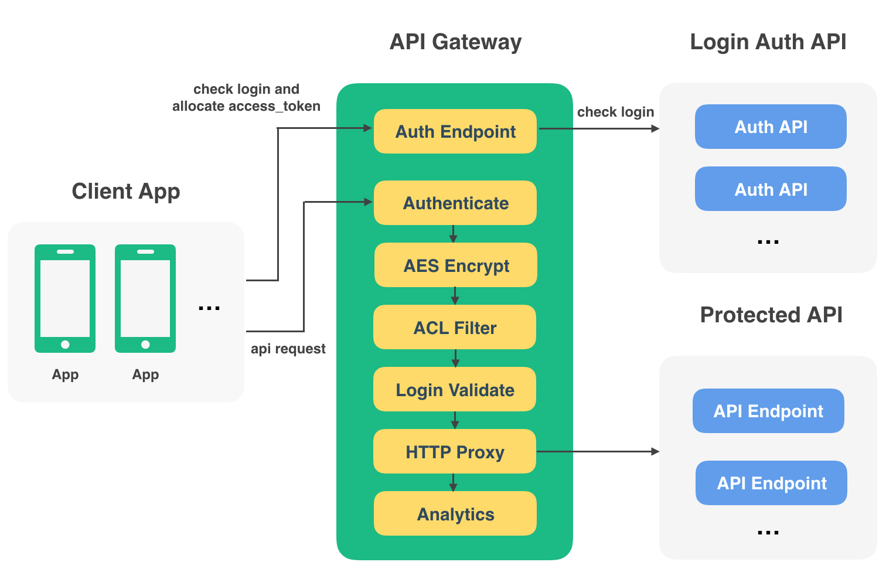

# API Gateway

API 是连接 App 和服务器数据库的桥梁，在 App 和各种 API 多了之后，对这些 API 的管理和保护就带来了一系列的问题。比如：

1. 如何保护 API 不被非法访问，只能由 App 正常发起请求？
2. 如何控制不同 App 对 多种多样 API 的访问权限？
3. API 的访问情况怎样，日志如何查看？

于是，就有了 API Gateway 这个项目。

## 环境及依赖

需要安装 redis, 当前只在 Python 2.7 环境下测试过

```
cerberus>=0.9
requests
six
tornado>=4.0
redis
pycrypto
ConcurrentLogHandler
```

## 运行

配置 settings.py 

```py
# 访问签名的有效时间, 秒
SIGNATURE_EXPIRE_SECONDS = 3600

HOST = '127.0.0.1'
PORT = 6500

# 是否调试模式
DEBUG = False

# redis 配置
REDIS_HOST = '127.0.0.1'
REDIS_PORT = 6379
REDIS_DB = 0
REDIS_PASSWORD = 'your_password'
REDIS_MAX_CONNECTIONS = 100
```

运行

    python runserver.py

## 相关项目

1. [api-gateway-dashbaord](https://github.com/restran/api-gateway-dashboard) API Gateway 的 Web 控制台
2. [api-python-sdk](https://github.com/restran/api-python-sdk) Python 版本的 API SDK


## 设计说明

这是一个 JSON API 的网关，实际上不管背后受保护的 API 传输的是什么，都能正常传输，只是网关会在出错时，以 JSON 数据返回错误信息。在设计上借鉴了 [torngas](https://github.com/mqingyn/torngas) 的中间件模式。当前仅支持 `GET` 和 `POST` 方法。



## 数据签名

和大多数的云应用一样，每个 Client 将会分配一对 `access_key` 和 `sercret_key`。`access_key` 用来唯一标识这个 Client，`sercret_key` 则用来执行 HMAC 签名和 AES 加密。API 请求的 URL 和 Body 数据都会被 `secret_key` 签名，并且会双向验证数据的签名，保证请求和返回的数据没有被篡改

### 特殊状态码

为了区分是网关层面执行时就出现错误返回数据，还是背后真正提供服务的 API 返回的数据，定义一个特殊的`状态码 600`，如果状态码为 600，则表示网关返回的。

### AES 加密

虽然 HTTPS 正在大多数网站中普及，但是如果仍然只能使用 HTTP，或者存在中间人攻击，数据内容就存在泄漏的风险，因此提供了 AES 加密的功能，可以对传输数据的 URL、Headers、Body 都进行加密，AES 加密是可选的。

### 登录校验

存在这样的情况，有些 API 需要登录后才能访问，有些则无需登录。api-gateway 内置了 Auth Endpoint, 包含了三个 API:

1. `/login/` 登录
2. `/logout/` 注销
3. `/token/` 用 `refresh_token` 获取新的 `access_token`

对于需要登录的 API，则需要先访问 `/login/` 获取 `access_token`, 返回的数据如下:

```json
{
    "code": 200,
    "msg": "",
    "data": {
        "access_token": "abcd",
        "refersh_token": "efgh",
        "expires_in": 1456512810,
        "user_info": {
        
        }
    }
}
```

- `expires_in`：`access_token` 的过期时间
- `refersh_token`：当 `access_token` 过期时，用来获取新的 `access_token`
- `user_info`：Auth API 返回的用户信息

`/login/` API 会根据配置的 Auth API 去校验提交的登录信息是否正确，如果登录正确 Auth API 返回用户信息。

`/token/` API 用来获取新的 `access_token`，提交的数据：

```json
{
	"refersh_token": "efgh"
}
```

以后访问需要登录保才能访问的 API 在 url 带上 access_token, 例如:

    http://example.com/api/v1/?access_token=abcd

API Gateway 在遇到访问需要登录的 API 时，就会根据这个 `access_token` 去 redis 中验证这个 `access_token` 是否有效，并获取该用户的信息。然后将用户信息存储在 Headers 中，以 `X-Api-User-Json` 传递给后端的 API。该 Header 存储的数据是 user_info 的 json 字符串的 base64 编码数据。


## TODO

- [x] 登录校验, 检查 `access_token`
- [x] 内置登录, 注销和更新 `access_token` 的 API
- [ ] 单点登录, 在一个地方登录, 旧的 `access_token` 和 `refresh_token` 要失效
- [ ] 访问统计数据, 原先为先缓存到 redis, 修改为直接写到 MongoDB
- [ ] api-android-sdk
- [ ] api-swift-sdk